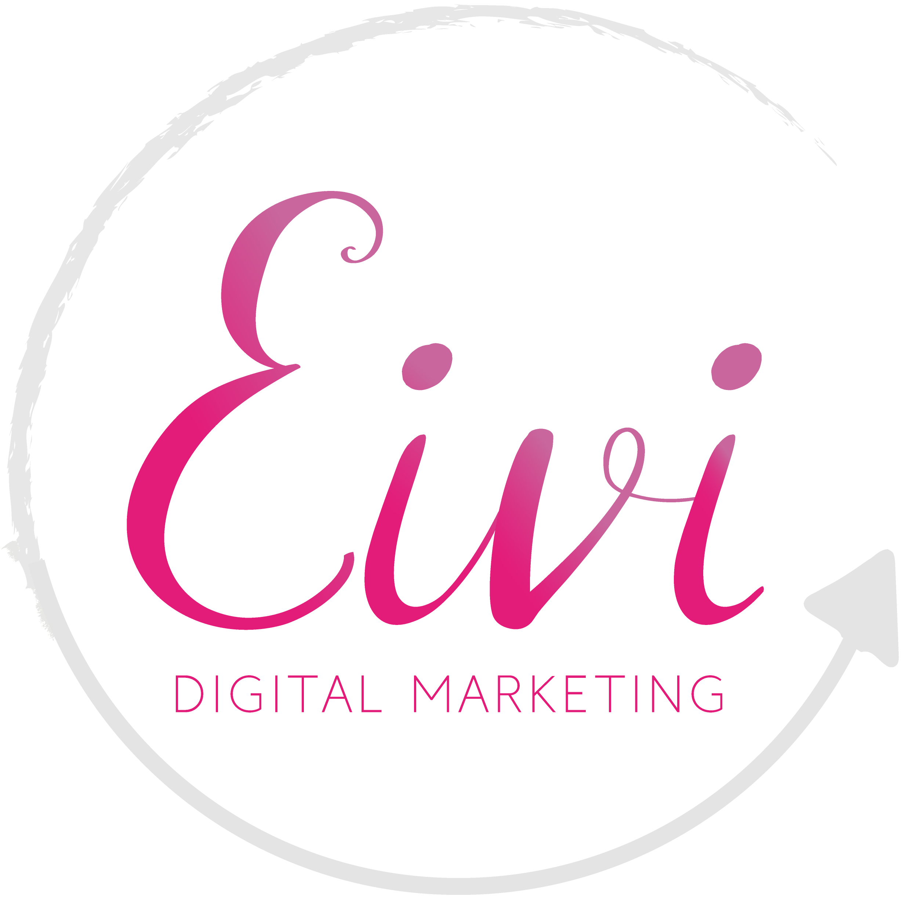

<a name="readme-top"></a>
<!--
*** Thanks for checking out the Best-README-Template. If you have a suggestion
*** that would make this better, please fork the repo and create a pull request
*** or simply open an issue with the tag "enhancement".
*** Don't forget to give the project a star!
*** Thanks again! Now go create something AMAZING! :D
-->


<!-- PROJECT SHIELDS -->
<!--
*** I'm using markdown "reference style" links for readability.
*** Reference links are enclosed in brackets [ ] instead of parentheses ( ).
*** See the bottom of this document for the declaration of the reference variables
*** for contributors-url, forks-url, etc. This is an optional, concise syntax you may use.
*** https://www.markdownguide.org/basic-syntax/#reference-style-links
-->
[![Contributors][contributors-shield]][contributors-url]
[![Forks][forks-shield]][forks-url]
[![Stargazers][stars-shield]][stars-url]
[![Issues][issues-shield]][issues-url]
[![GNU License][license-shield]][license-url]


<!-- PROJECT LOGO -->
<br />
<div align="center">
  <a href="**https://github.com/andrezzamp/eivi**">
    
  </a>

  <h3 align="center">Eivi Digital</h3>

  <p align="center">
    We'll help you capitalise on your digital channels while you run your business.
    <br />
    <a href="https://github.com/andrezzamp/eivi"><strong>Explore the docs »</strong></a>
    <br />
    <br />
    <a href="https://www.eividigital.co.nz">View Demo</a>
    ·
    <a href="https://github.com/andrezzamp/eivi/issues">Report Bug</a>
    ·
    <a href="https://github.com/andrezzamp/eivi/issues">Request Feature</a>
  </p>
</div>


<!-- TABLE OF CONTENTS -->
<details>
  <summary>Table of Contents</summary>
  <ol>
    <li>
      <a href="#about-the-project">About The Project</a>
      <ul>
        <li><a href="#built-with">Built With</a></li>
      </ul>
    </li>
    <li>
      <a href="#getting-started">Getting Started</a>
      <ul>
        <li><a href="#prerequisites">Prerequisites</a></li>
        <li><a href="#installation">Installation</a></li>
      </ul>
    </li>
    <li><a href="#usage">Usage</a></li>
    <li><a href="#roadmap">Roadmap</a></li>
    <li><a href="#contributing">Contributing</a></li>
    <li><a href="#license">License</a></li>
    <li><a href="#contact">Contact</a></li>
  </ol>
</details>


<!-- ABOUT THE PROJECT -->
## About The Project

[![Eivi][product-screenshot]](https://eividigital.co.nz)

The project is a website for a Social Media Management Agency with a clean design and 6 pages, a home page, a page to learn more about the company, the services and prices, a portfolio page, a blog, and a contact page. The completed project will also have two places to capture leads: a newsletter form and the contact form. 

<p align="right">(<a href="#readme-top">back to top</a>)</p>


### Built With


* CSS 
* EJS 
* ExpressJS 
* Git 
* HTML
* Javascript
* MySQL
* NodeJS
* PhpMyAdmin
* Visual Studio Code 
* XAMPP


<p align="right">(<a href="#readme-top">back to top</a>)</p>


<!-- GETTING STARTED -->
## Getting Started


### Prerequisites

You will need NodeJS v18, NPM v8 and mySQL v*


### Installation


1. Clone the repo
   ```sh
   git clone git@github.com:andrezzamp/eivi.git
   ```
3. Install NPM packages
   ```sh
   npm install
   ```
4. Create an .env file containing
   ```env
    PORT=

    DATABASE_HOST=
    DATABASE_USER=
    DATABASE_PASSWORD=
    DATABASE_NAME=

    GMAIL_EMAIL=
    GMAIL_PASSWORD=
    CONTACT_EMAIL=
   ```
5. Import 'db_dump.sql' to generate your mySQL schema
   
<p align="right">(<a href="#readme-top">back to top</a>)</p>


<!-- USAGE EXAMPLES -->
## Usage

Use this space to show useful examples of how a project can be used. Additional screenshots, code examples and demos work well in this space. You may also link to more resources.

_For more examples, please refer to the [Documentation](https://example.com)_

<p align="right">(<a href="#readme-top">back to top</a>)</p>


<!-- ROADMAP -->
## Roadmap

- [ ] Add content management system
- [ ] Add more dynamic content
- [ ] Add input sanitization
- [ ] Add input validation
- [ ] Add reCAPTCHA
- [ ] Add tests

See the [open issues](https://github.com/andrezzamp/eivi/issues) for a full list of proposed features (and known issues).

<p align="right">(<a href="#readme-top">back to top</a>)</p>


<!-- CONTRIBUTING -->
## Contributing

Contributions are what make the open source community such an amazing place to learn, inspire, and create. Any contributions you make are **greatly appreciated**.

If you have a suggestion that would make this better, please fork the repo and create a pull request. You can also simply open an issue with the tag "enhancement".
Don't forget to give the project a star! Thanks again!

1. Fork the Project
2. Create your Feature Branch (`git checkout -b feature/AmazingFeature`)
3. Commit your Changes (`git commit -m 'Add some AmazingFeature'`)
4. Push to the Branch (`git push origin feature/AmazingFeature`)
5. Open a Pull Request

<p align="right">(<a href="#readme-top">back to top</a>)</p>


<!-- LICENSE -->
## License

Distributed under the GNU License. See `LICENSE.txt` for more information.

<p align="right">(<a href="#readme-top">back to top</a>)</p>

****

<!-- CONTACT -->
## Contact

Andrezza Malcher - [@dezzamp](https://twitter.com/dezzamp) - hello@eividigital.co.nz

Project Link: [https://github.com/andrezzamp/eivi](https://github.com/andrezzamp/eivi)

<p align="right">(<a href="#readme-top">back to top</a>)</p>


<!-- MARKDOWN LINKS & IMAGES -->
<!-- https://www.markdownguide.org/basic-syntax/#reference-style-links -->
[contributors-shield]: https://img.shields.io/github/contributors/andrezzamp/eivi.svg?style=for-the-badge
[contributors-url]: https://github.com/andrezzamp/eivi/graphs/contributors
[forks-shield]: https://img.shields.io/github/forks/andrezzamp/eivi?style=for-the-badge
[forks-url]: https://github.com/andrezzamp/eivi/network/members
[stars-shield]: https://img.shields.io/github/stars/andrezzamp/eivi?style=for-the-badge
[stars-url]: https://github.com/andrezzamp/eivi/stargazers
[issues-shield]: https://img.shields.io/github/issues/andrezzamp/eivi?style=for-the-badge
[issues-url]: https://github.com/andrezzamp/eivi/issues
[license-shield]: https://img.shields.io/badge/License-GPLv3-blue.svg?style=for-the-badge
[license-url]: https://github.com/andrezzamp/eivi/blob/master/LICENSE.txt
[product-screenshot]: public/img/app-screenshot.jpeg
